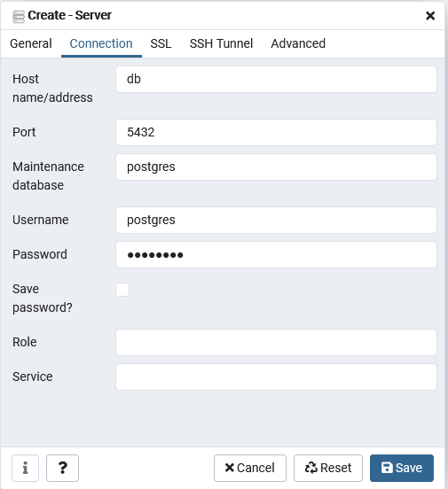

# Código desarrollado por _David Esteban Fajardo Torres_

Correo: destebanft@protonmail.com

Tel: +57 320 251 1039

### Tecnologías utilizadas:

- Framework: Django
- Autenticación: django-oauth-toolkit
- API rest: djangorestframework
- Database: Postgres
- Docker: Docker-compose

Mediante docker compose se ejecuta postgres, django y un proxy(nginx), lo configure para que todas las peticiones y conexiones se hagan mediante el proxy. Con el sofware _Postman_ probé los endpoints.

### Endpoints (_Postman_):

- http://127.0.0.1:5500/api/v1/users/login/ Inicio de sesión, obtiene el access token y el refresh token para las rutas privatas (POST)
- http://127.0.0.1:5500/api/v1/user/ Crear usuarios (POST)
- http://127.0.0.1:5500/api/v1/user/5/ Actualizar usuario (PUT)
- http://127.0.0.1:5500/api/v1/user/5/ Eliminar usuario (DELETE)
- http://127.0.0.1:5500/api/properties/assign_owners asignar propietarios a las propiedades (POST)
- http://127.0.0.1:5500/api/v1/users/ obtener usuarios (GET)

### Pasos para ejecutar el proyecto:

1. Agregue el archivo .env dentro del directorio api (a la altura del manage.py). Este archivo esta en el correo.
2. Instale la extención de docker en VsCode y luego de en la opción de abrir en contenedor. Esto le va solicitar un archivo para ejecutar el contenedor, seleccione _docker-compose.override.yml_. Este proceso puede tardar un poco.
3. Luego de que se ejecute el docker compose _docker-compose.override.yml_. Se abrira una terminal (_django@a0cc19f5f07b:/workspace$_). En ese momento vaya a su navegador, ingrese a la dirección http://localhost:8181 (dirección de pgAdmin), ingrese con el correo admin@quick.com y la contraseña admin.
4. Cree un server con el nombre local_db, en la conexión use la siguiente configuración (password:postgres)

5. Importe el archivo data_backup dentro de la base de datos data. Enviado al correo.

6. En archivo quick.postman_collection.json están las peticiones para hacer pruebas en el api mediante el software postman. Enviado al correo.

